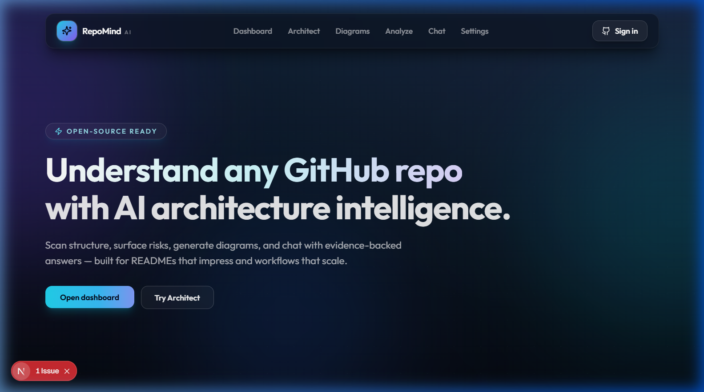
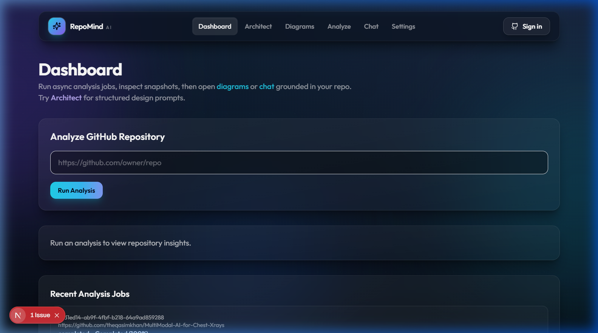
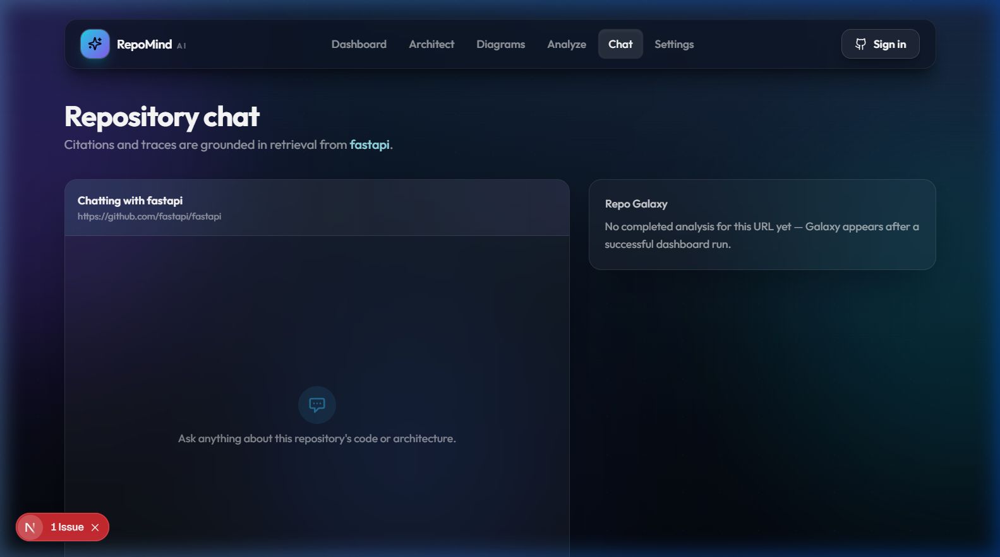

# RepoMind AI

<p align="center">
  
</p>

<p align="center">
  <a href="#local-development"></a>
  <a href="#local-development"></a>
  <a href="#local-development"></a>
  <a href="#local-development"></a>
  
</p>

<p align="center">
  <strong>AI-powered GitHub repository intelligence — clone, analyse, chat, and visualise any public repo in seconds.</strong>
</p>

---

## ✨ Features

| Feature | Details |
|---|---|
| **Repository analysis** | Deep-clones any public GitHub repo (shallow, depth 48); scans files, parses dependencies, detects stack signals, generates commit timeline |
| **RAG-grounded chat** | FAISS semantic search; optional HyDE query expansion; optional cross-encoder reranking; chunk-level citations in responses |
| **Bounded agent** | Multi-tool loop (retrieve → summarise → diagram → answer) with configurable round limits; gracefully degrades to single-shot RAG |
| **Mermaid diagrams** | Heuristic `flowchart TB` from detected stack — frontend/backend/DB/RAG/devops/architecture-pattern nodes; ML repos show Streamlit / Gradio / Jupyter |
| **3D Repo Galaxy** | WebGL force graph of file-tree and API paths; highlighted by chat evidence |
| **Code DNA** | Language distribution panel derived from file extensions |
| **Async jobs** | Progress-polled analysis jobs (Celery + Redis or asyncio fallback); full job history in dashboard |
| **Auth** | GitHub OAuth; JWT in an httpOnly cookie (`repomind_token`); API accepts **cookie or Bearer** |
| **ML repo support** | Detects Streamlit, Gradio, Jupyter notebooks, Panel, and Plotly Dash as frontend signals |

---

## 📸 Screenshots

<p align="center">
  
  &nbsp;
  
</p>

---

## 🗂️ Monorepo layout

```text
RepoMind AI/
├── ai_engine/           # RAG pipeline — LLM orchestration (Gemini / OpenRouter)
├── repo-parser/         # Heuristic stack detector & chunking helpers
├── diagram-engine/      # Standalone Mermaid generation service
├── vector-store/        # FAISS VectorIndex wrapper & indexing utilities
├── backend/             # FastAPI app — APIs, auth, services, Celery worker entry
│   ├── app/
│   │   ├── api/v1/      # repositories, chat, auth, health, retrieval-eval routes
│   │   ├── core/        # config (pydantic-settings), dependencies
│   │   ├── models/      # SQLAlchemy ORM models
│   │   ├── repositories/# SQLite access layer (analysis jobs, chunks, users)
│   │   ├── schemas/     # Pydantic request/response schemas
│   │   ├── services/    # Business logic (repository, chat, embedding, HyDE, rerank)
│   │   ├── utils/       # URL normalisation, helpers
│   │   └── worker/      # Celery app & tasks
│   └── tests/           # pytest suites
├── frontend/            # Next.js 15 (App Router, Tailwind CSS, Framer Motion)
│   ├── app/             # Pages: dashboard, chat, diagrams, architect, auth, settings
│   ├── components/      # UI components (ChatInterface, MermaidDiagram, RepoGalaxy3D …)
│   └── lib/             # API client, types, URL utilities
├── workers/             # Supplementary worker notes (main Celery app under backend/)
├── docker/              # Dockerfiles for backend & frontend
├── docker-compose.yml   # Full-stack compose definition
└── docs/                # Architecture & advancement phase docs
```

---

## 🔧 Prerequisites

- **Python 3.10+**
- **Node.js 18+** and npm
- **Redis** — Celery broker; run locally or via Docker
- **SQLite** — default persistence (no extra setup needed)
- **Git** — must be on `PATH` (used for shallow clones)

At least one LLM provider key is required for chat and agent features:

| Provider | Key variable | Where to get it |
|---|---|---|
| Google Gemini | `GEMINI_API_KEY` | [aistudio.google.com/app/apikey](https://aistudio.google.com/app/apikey) |
| OpenRouter | `OPENROUTER_API_KEY` | [openrouter.ai/keys](https://openrouter.ai/keys) |
| OpenAI | `OPENAI_API_KEY` | [platform.openai.com/api-keys](https://platform.openai.com/api-keys) |

> Repository cloning and structural analysis run without any API key.  
> Chat, HyDE, and the agent loop require at least one key.

---

## ⚙️ Environment variables

### Backend — `backend/.env`

Copy the template first:

```bash
# Windows PowerShell
Copy-Item backend/.env.example backend/.env

# macOS / Linux
cp backend/.env.example backend/.env
```

Then edit `backend/.env`:

| Variable | Required | Description |
|---|---|---|
| `GEMINI_API_KEY` | ✅ for chat | Gemini API key |
| `OPENROUTER_API_KEY` | optional | OpenRouter key (alternative / additional model) |
| `JWT_SECRET` | ✅ | Random 32-char secret — generate with `python -c "import secrets; print(secrets.token_urlsafe(32))"` |
| `CORS_ORIGINS` | ✅ | Exact frontend origin, e.g. `http://localhost:3000` — **never `*`** with cookies |
| `FRONTEND_URL` | ✅ | OAuth redirect base, e.g. `http://localhost:3000` |
| `GITHUB_CLIENT_ID` | optional | GitHub OAuth app client ID |
| `GITHUB_CLIENT_SECRET` | optional | GitHub OAuth app client secret |
| `SQLITE_DB_PATH` | optional | SQLite file path (default: `repomind.db`) |
| `REDIS_URL` | optional | Celery broker (default: `redis://localhost:6379/0`) |

> **Security:** `backend/.env` is listed in `.gitignore` — never commit it.  
> The `.gitignore` blocks all `**/.env` and `**/.env.*` files globally.

### Frontend — `frontend/.env.local`

```bash
# Windows PowerShell
Copy-Item frontend/.env.example frontend/.env.local

# macOS / Linux
cp frontend/.env.example frontend/.env.local
```

| Variable | Description |
|---|---|
| `NEXT_PUBLIC_API_BASE_URL` | Backend base URL, e.g. `http://localhost:8000` |

---

## 🚀 Local development

### 1 — Backend

```powershell
# From the repo root (PowerShell)
cd backend
python -m venv .venv
.\.venv\Scripts\Activate.ps1
pip install -r requirements.txt
```

```bash
# macOS / Linux
cd backend
python -m venv .venv
source .venv/bin/activate
pip install -r requirements.txt
```

Start the API server (the SQLite schema is created automatically on first run):

```bash
uvicorn app.main:app --reload --host 0.0.0.0 --port 8000
```

Optional — start a Celery worker for background analysis jobs (requires Redis):

```bash
celery -A app.worker.celery_app worker --loglevel=info
```

> Without Redis/Celery, jobs fall back to `asyncio.create_task` automatically.

### 2 — Frontend

```bash
cd frontend
npm install
npm run dev
```

Open **http://localhost:3000**.

### 3 — Docker Compose (full stack)

```bash
# From repo root
docker compose up --build
```

Ensure both `backend/.env` and `frontend/.env.local` exist before running Compose — they are referenced by `docker-compose.yml`.

---

## 🌐 API overview

Base path: `/api/v1`

| Method | Path | Description |
|---|---|---|
| `POST` | `/repositories/analyze` | Synchronous analysis (small repos) |
| `POST` | `/repositories/analyze/async` | Start async analysis job |
| `GET` | `/repositories/analyze/async/{job_id}` | Poll job status |
| `GET` | `/repositories/analyze/async` | List recent jobs |
| `GET` | `/repositories/analysis/latest?repo_url=…` | Fetch latest completed snapshot |
| `POST` | `/chat/query` | RAG-grounded chat query |
| `GET` | `/health` | Health check |
| `GET/POST` | `/auth/*` | GitHub OAuth flow |

Interactive docs: **http://localhost:8000/docs**

---

## 🔍 URL formats accepted

The backend normalises all of the following to `https://github.com/owner/repo`:

```text
https://github.com/owner/repo
http://github.com/owner/repo
github.com/owner/repo
owner/repo
git@github.com:owner/repo.git
```

---

## 🧠 Stack detection signals

`repo-parser/stack_detector.py` and `backend/app/services/repository_service.py` detect:

**Frontend** — Next.js, React, Vue, Angular, Svelte, Nuxt, Vite, Tailwind CSS, **Streamlit, Gradio, Jupyter notebooks, Panel, Plotly Dash**

**Backend** — FastAPI, Flask, Django, Express/Node.js, Spring Boot + language signals (Python, Go, Rust, Java, Node.js)

**Databases** — PostgreSQL, MongoDB, MySQL, Redis, SQLite, SQLAlchemy, Prisma

**DevOps** — Docker, GitHub Actions, Kubernetes, Terraform, Make

---

## 🧪 Testing

```bash
cd backend
python -m pytest tests -q
```

Retrieval, chunking, and chat coverage live under `backend/tests/`.

---

## 📋 Recent improvements

| Area | Change |
|---|---|
| **URL normalisation** | All four GitHub URL formats (`https://`, `github.com/`, `owner/repo`, SSH) now resolve to a canonical clone URL before `git clone` |
| **ML frontend detection** | Streamlit, Gradio, Jupyter, Panel, Plotly Dash added to both `stack_detector.py` and `repository_service.py` |
| **Mermaid diagrams** | `diagram-engine/mermaid_service.py` rewritten from a fixed 5-node stub into a full `flowchart TB` generator matching the backend service |
| **Chat link** | Dashboard "Chat" button now uses `repo_clone_url` from the analysis result (already canonical) instead of re-normalising `job.repo_url` client-side |
| **`.gitignore`** | Broadened to `**/.env` + `**/.env.*` glob; `.env.example` templates are explicitly allowed |
| **Key hygiene** | `backend/.env` ships with blank `GEMINI_API_KEY` and `OPENROUTER_API_KEY` — add your own locally and never commit |

---

## 🗺️ Roadmap

Phased work is tracked in [docs/ADVANCEMENT_PHASES.md](docs/ADVANCEMENT_PHASES.md):

- **Phase 1 (done)** — Core analysis, FAISS RAG, embedding cache, async jobs
- **Phase 2 (done)** — GitHub OAuth, JWT auth, HyDE, cross-encoder rerank, Celery
- **Phase 3 (active)** — Bounded tool agent, diagram tool, multi-step reasoning
- **Phase 4 (planned)** — Multi-repo comparisons, PR-level diff chat, CI integration

---

## 📄 License

This project is released under the **MIT License** — see [LICENSE](LICENSE) for details.
