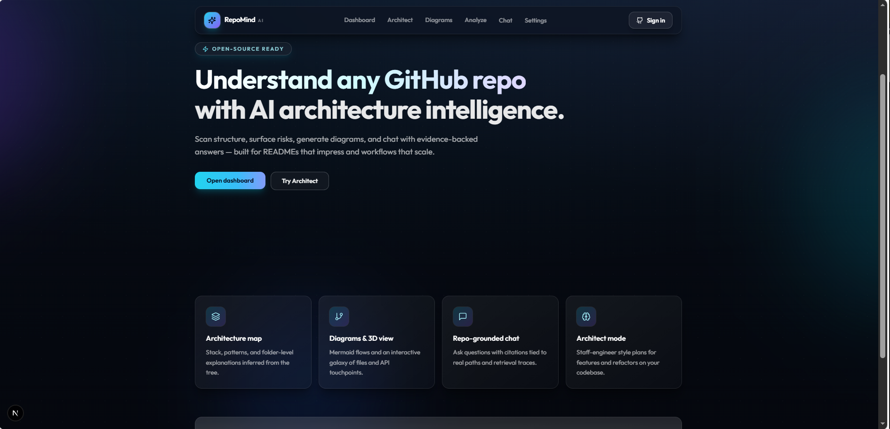
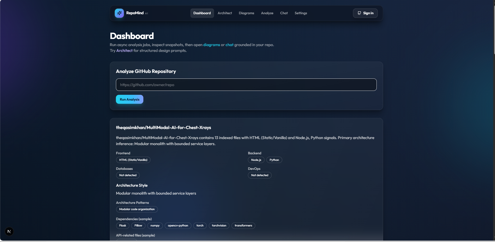
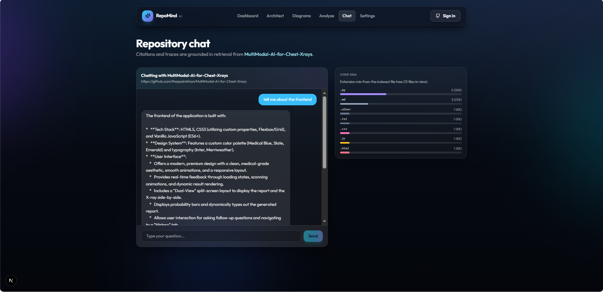
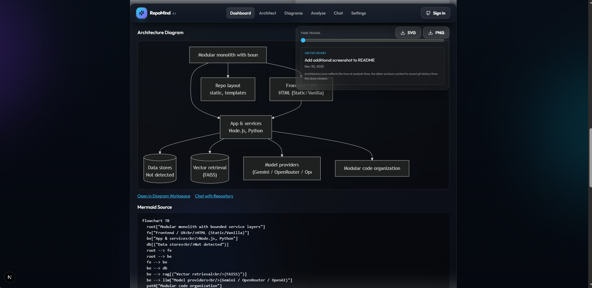

# 🧠 RepoMind AI

<div align="center">
  
</div>

<br/>

<div align="center">
  <a href="#-architecture--tech-stack"></a>
  <a href="#-architecture--tech-stack"></a>
  <a href="#-architecture--tech-stack"></a>
  <a href="#-architecture--tech-stack"></a>
  
</div>

<br/>

<p align="center">
  <strong>An AI-powered GitHub repository intelligence platform. Clone, analyze, chat, and visualize any public codebase in seconds.</strong>
</p>

---

## 📖 Table of Contents
- [✨ Key Features](#-key-features)
- [📸 Showcase](#-showcase)
- [🏗️ Architecture & Tech Stack](#-architecture--tech-stack)
- [🚀 Quick Start Guide](#-quick-start-guide)
  - [Prerequisites](#prerequisites)
  - [Environment Variables](#environment-variables)
  - [Local Development](#local-development)
  - [Docker Compose](#docker-compose)
- [🌐 API Overview](#-api-overview)
- [🗺️ Roadmap](#️-roadmap)
- [📄 License](#-license)

---

## ✨ Key Features

- **🚀 Instant Repository Analysis:** Deep-clones public GitHub repositories, performs static analysis, parses dependencies, and detects stack signals.
- **🤖 RAG-Grounded AI Chat:** Talk to your codebase! Powered by **FAISS semantic search**, HyDE query expansion, and cross-encoder reranking. Every AI response includes precise chunk-level citations.
- **⚙️ Bounded Agent Loop:** Intelligent multi-tool agent that autonomously retrieves, summarizes, and generates diagrams, gracefully falling back to single-shot RAG when needed.
- **🌌 3D Repo Galaxy:** Stunning WebGL force-directed graph to visualize file trees, API paths, and code relationships in 3D space.
- **📊 Auto-Generated Architecture Diagrams:** Generates heuristic `flowchart TB` Mermaid diagrams mapping out frontend, backend, DBs, DevOps, and even ML components (Streamlit, Jupyter, etc.).
- **⚡ Async Task Processing:** Uses **Celery & Redis** for background analysis jobs with real-time polling (includes an `asyncio` fallback).
- **🔐 Secure Authentication:** Seamless GitHub OAuth integration with `httpOnly` JWT cookies for maximum security.

---

## 📸 Showcase

<div align="center">
  
  
</div>

---

## 🏗️ Architecture & Tech Stack

RepoMind is built as a highly scalable, decoupled monorepo:

<div align="center">
  
</div>

<br/>

* **Backend:** FastAPI (Python), SQLAlchemy (SQLite/PostgreSQL), Celery, Redis.
* **Frontend:** Next.js 15 (App Router), React, Tailwind CSS, Framer Motion, Three.js (WebGL).
* **AI Engine:** LangChain, FAISS (Vector Database), Sentence Transformers (Embeddings), Google Gemini & OpenRouter integrations.

### Directory Structure
```text
RepoMind AI/
├── ai_engine/           # RAG pipeline & LLM orchestration
├── backend/             # FastAPI core, API routes, Auth, Celery workers
├── frontend/            # Next.js 15 web application
├── repo-parser/         # Heuristic codebase and stack detector
├── diagram-engine/      # Standalone Mermaid generation service
├── vector-store/        # FAISS VectorIndex wrapper
├── docker/              # Production & Dev Dockerfiles
└── docker-compose.yml   # Full-stack orchestration
```

---

## 🚀 Quick Start Guide

### Prerequisites
- **Python 3.10+**
- **Node.js 18+** & npm
- **Redis** (For Celery background tasks)
- **Git** (Must be accessible in your `PATH`)

You will also need at least one LLM API key:
- **Google Gemini:** `GEMINI_API_KEY` ([Get here](https://aistudio.google.com/app/apikey))
- **OpenRouter:** `OPENROUTER_API_KEY` ([Get here](https://openrouter.ai/keys))

### Environment Variables

**1. Backend (`backend/.env`)**
```bash
# Windows
Copy-Item backend/.env.example backend/.env
# Mac/Linux
cp backend/.env.example backend/.env
```
Edit the `.env` file to add your API keys. Generate a `JWT_SECRET` using `python -c "import secrets; print(secrets.token_urlsafe(32))"`.

**2. Frontend (`frontend/.env.local`)**
```bash
# Windows
Copy-Item frontend/.env.example frontend/.env.local
# Mac/Linux
cp frontend/.env.example frontend/.env.local
```

### Local Development

**Terminal 1: Start the Backend (FastAPI)**
```bash
cd backend
python -m venv .venv

# On Windows: 
.\.venv\Scripts\Activate.ps1
# On Mac/Linux: 
source .venv/bin/activate

pip install -r requirements.txt
uvicorn app.main:app --reload --host 0.0.0.0 --port 8000
```

*(Optional) Terminal 2: Start Celery Worker*
```bash
cd backend
celery -A app.worker.celery_app worker --loglevel=info
```

**Terminal 3: Start the Frontend (Next.js)**
```bash
cd frontend
npm install
npm run dev
```
Open **[http://localhost:3000](http://localhost:3000)** in your browser!

### Docker Compose
To run the entire stack effortlessly without manual setups:
```bash
docker compose up --build
```
*(Ensure your `.env` and `.env.local` files are created first!)*

---

## 🌐 API Overview

All endpoints are prefixed with `/api/v1`. Interactive Swagger UI is available at `http://localhost:8000/docs`.

| Method | Endpoint | Description |
|---|---|---|
| `POST` | `/repositories/analyze/async` | Trigger background async analysis job |
| `GET` | `/repositories/analyze/async/{id}`| Poll analysis job status |
| `POST` | `/chat/query` | Submit a RAG-grounded query to a repository |
| `GET` | `/auth/github` | Initiate GitHub OAuth flow |

---

## 🗺️ Roadmap

- [x] **Phase 1** — Core analysis, FAISS RAG, embedding cache, async jobs
- [x] **Phase 2** — GitHub OAuth, JWT auth, HyDE, cross-encoder rerank, Celery
- [x] **Phase 3** — Bounded tool agent, generative diagramming, multi-step reasoning
- [ ] **Phase 4** — Multi-repo comparisons, PR-level diff chat, CI integrations

---

## 📄 License

Distributed under the **MIT License**. See [LICENSE](LICENSE) for more information.

<br/>

<div align="center">
  <i>Developed with ❤️ by <a href="https://github.com/QasimKhan">Qasim Khan</a></i>
</div>
